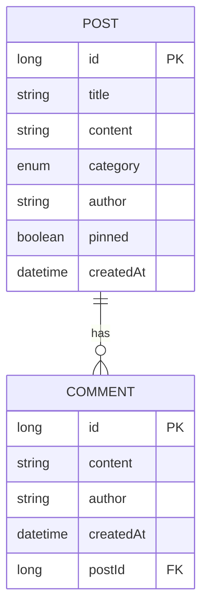

# Projekt 4

1. Projekt polega na stworzeniu aplikacji typu forum, w której użytkownicy mogą publikować ogłoszenia, dodawać komentarze, a także korzystać z zaawansowanych filtrów wyszukiwania.

2. Diagram encji

3. Instrukcja uruchomienia - zielona strzałka

4. Opis scopów i uzasadnienie - Scope singleton jest używany przy Statsach autorów bo chcemy aby one były zawsze takie same dla każdego beana który bedzie je uzywal. Request scope jest używany przy logowaniu akcji bo to jest akcja na request uzytkownika.
